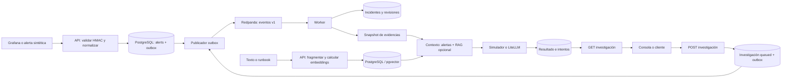
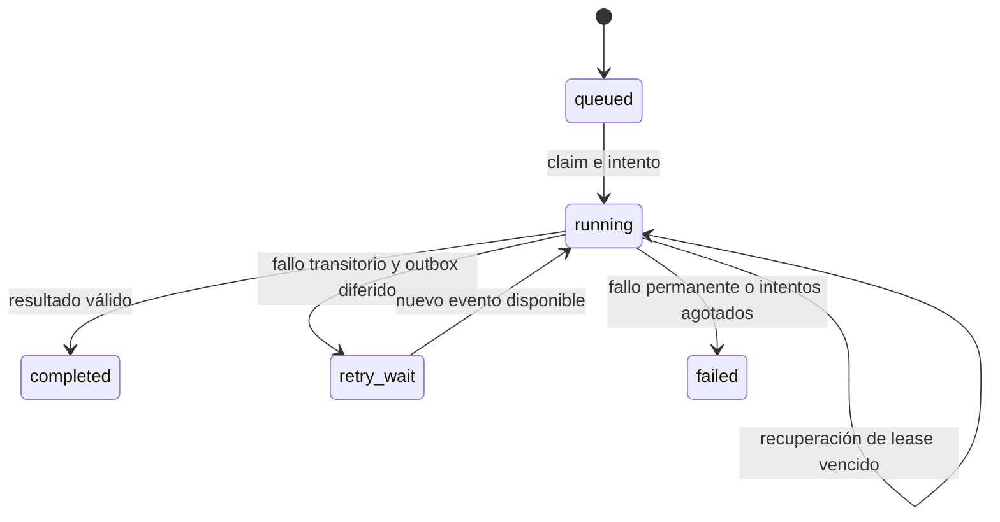

# Flujo actual de Vigilia

Estado después de la migración, actualizado el 7 de octubre de 2026. El código activo está en `src/vigilia`; [el roadmap](VIGILIA_ROADMAP.md) recoge el trabajo pendiente.

## Recorrido del producto

Los almacenes son tablas de la misma base PostgreSQL. Hay tres procesos de aplicación: API, publicador y worker. La indexación de documentos ocurre durante la petición HTTP; no existe un topic de indexación ni un worker específico de conocimiento.

## 1. Ingesta y publicación

1. Grafana envía `POST /webhooks/grafana` con firma HMAC-SHA256 y timestamp. Se verifican la firma y la ventana temporal antes de aceptar el cuerpo.
2. `adapters/grafana` valida y transforma el payload en `NormalizedAlert`. El servicio procede de `labels.service`, de `labels.instance` o de `unknown`.
3. `IngestAlerts` guarda alertas nuevas y eventos outbox en la misma transacción. La clave natural de deduplicación usa origen, fingerprint, inicio y estado.
4. La API devuelve `202` con contadores de recepción, normalización, persistencia y eventos encolados. No necesita publicar directamente en Kafka.
5. El publicador reclama un lote con `SKIP LOCKED`, lease y token; confirma el claim y publica fuera de la transacción.
6. Marca las entregas exitosas y reprograma las fallidas con backoff. Una caída después de publicar puede duplicar la entrega.

Los topics activos son `alerts.received.v1` e `investigations.requested.v1`. El sobre `EventEnvelope` contiene `event_id`, `event_type`, `aggregate_id`, `occurred_at`, `correlation_id`, `causation_id` y `payload`. El worker valida este contrato; ya no convierte mensajes antiguos sin sobre.

## 2. Correlación de alertas

El consumer carga la alerta persistida y llama a `CorrelateAlert`. Un advisory lock PostgreSQL por servicio serializa correlaciones concurrentes. La deduplicación en `processed_events` y el efecto de negocio comparten transacción; el offset solo se confirma después.

- `firing`: buscar un incidente abierto reciente del mismo servicio dentro de la ventana configurada (45 minutos por defecto). Adjuntar la alerta o crear un incidente.
- `resolved`: buscar un incidente abierto asociado al fingerprint, adjuntar el evento y calcular el último estado de cada fingerprint. Si no hay coincidencia, el evento queda sin asociación.
- Resolver el incidente cuando todos sus fingerprints tienen como último estado `resolved`.
- Incrementar la revisión solo al adjuntar una alerta nueva. Mantener la severidad máxima observada: `critical > warning > info > unknown`.

Una alerta firing y su resolved son dos eventos guardados. El fingerprint identifica una instancia de alerta; el incidente agrupa varias instancias relacionadas. `incident_alerts` permite reconstruir la línea temporal.

## 3. Solicitud de investigación

La consola o un cliente llama a `POST /incidents/{id}/investigations`. `RequestInvestigation` bloquea el incidente, reutiliza una `Idempotency-Key` existente y evita investigaciones activas duplicadas para la misma revisión y analizador mediante una restricción persistente.

La solicitud `queued` y el evento `investigations.requested.v1` se guardan juntos. La respuesta `202` devuelve el ID y `Location: /investigations/{id}`. La API termina sin esperar al análisis.

La revisión solicitada se persiste. El snapshot se construye cuando el worker reclama el trabajo con las alertas disponibles entonces; todavía queda pendiente fijar estrictamente la evidencia a la revisión solicitada si el incidente cambia mientras está en cola.

## 4. Ejecución, resultado y recuperación

1. El worker deduplica el evento y bloquea la investigación.
2. Ignora estados terminales; espera trabajos todavía no disponibles o con lease vigente.
3. Reclama el trabajo con `attempt_token`, contador, vencimiento de lease y una fila de intento. Un intento vencido se registra como fallido.
4. Lee la incidencia y su evidencia, construye el snapshot y confirma la transacción corta.
5. Recupera conocimiento si RAG está activado y llama al analizador fuera de la transacción de claim. La recuperación abre su propia operación PostgreSQL; no mantiene un bloqueo mientras responde el proveedor.
6. Abre otra transacción y verifica el token antes de guardar resultado o fallo. Un worker que perdió el lease no puede sobrescribir un intento nuevo.
7. Confirma el offset después del efecto durable. Un reinicio puede volver a entregar el evento y recuperar el trabajo cuando vence su lease.

Timeouts, rate limits y fallos de conexión/servidor pueden reintentarse con límite y backoff. Credenciales inválidas, configuración incompatible y salida estructurada inválida son fallos permanentes. `insufficient_evidence` completa la investigación sin inventar una causa.

El resultado `incident_investigation.v1` contiene resumen, hipótesis, evidencias, comprobaciones y datos ausentes. Las referencias `alert:<uuid>` y `knowledge:<uuid>` se validan contra el contexto entregado. Cada intento exitoso guarda proveedor/modelo, tokens, coste estimado, ID de respuesta y latencia cuando están disponibles.

## 5. Conocimiento operacional

`POST /knowledge/documents` identifica documentos por servicio, entorno y fuente. La API limpia patrones comunes de secretos, fragmenta el texto, calcula embeddings mediante LiteLLM y reemplaza documento y chunks de forma transaccional. El modelo de embeddings es independiente del generador.

Al investigar, el worker construye una consulta desde el snapshot, calcula su embedding y busca por distancia coseno exacta en pgvector. Filtra por entorno, servicio (incluido `*` para documentos compartidos), modelo y dimensiones; limita fragmentos y caracteres del contexto.

Los resultados conservan los fragmentos recuperados y las citas, aunque después se reemplace o borre el documento. `GET /knowledge/documents` lista metadatos sin llamar a embeddings y funciona con RAG apagado. La ingesta necesita RAG activado. [La guía RAG](docs/rag.md) detalla configuración y límites.

## 6. Consola y lectura

`/ui/` sirve HTML, CSS y módulos JavaScript incluidos en el paquete. El Bearer vive en memoria. Overview, Incidents, Alerts y Knowledge usan la API del mismo origen; el detalle de investigación consulta su estado cada tres segundos mientras la vista está visible y el trabajo sigue activo.

Las listas de alertas y documentos son paginadas. El listado de incidentes todavía devuelve todo el conjunto. La consola distingue estados de carga, vacío y error, y representa los datos externos como texto. [La documentación de la consola](docs/web-console.md) recoge su alcance.

## 7. Mapa del código

| Ruta | Responsabilidad |
| --- | --- |
| `domain/models.py`, `domain/correlation.py` | Valores, evidencias y reglas puras |
| `application/use_cases.py` | Ingesta, correlación, comandos y consultas de investigaciones |
| `application/knowledge.py` | Indexación, recuperación y consultas de conocimiento |
| `application/contracts.py`, `application/ports.py` | DTOs, sobre de eventos y fronteras externas |
| `adapters/http/`, `adapters/grafana/` | API, seguridad, consola y normalización |
| `adapters/postgres/` | Modelos, consultas y Unit of Work async |
| `adapters/messaging/` | Producer/consumer y control de offsets |
| `adapters/simulation/`, `adapters/llm/` | Implementaciones de análisis y embeddings |
| `bootstrap/` | Configuración, composición y ciclo de recursos |
| `main.py`, `publisher.py`, `worker.py` dentro del paquete | Entradas de los tres procesos |

## 8. Qué se conserva de la migración

La cadena Alembic permanece completa para actualizar instalaciones existentes. `reports` es una tabla archivada sin lectura desde los casos de uso: sus filas se copiaron a investigaciones completadas con esquema `legacy_report.v1`. Ese formato histórico se consulta por investigaciones y se muestra como JSON en la consola.

El topic antiguo no se borra del broker ni se eliminan volúmenes. El worker escucha solo los topics v1. Antes de aplicar esta limpieza a otro entorno, drena su topic y outbox antiguos. En el entorno local revisado el topic antiguo estaba vacío y el outbox no tenía filas pendientes.

Para reproducir el flujo con infraestructura real y sin llamadas a proveedores: sigue [README](README.md), arranca con simulador y RAG apagado, y ejecuta `make test` y `make smoke`.
