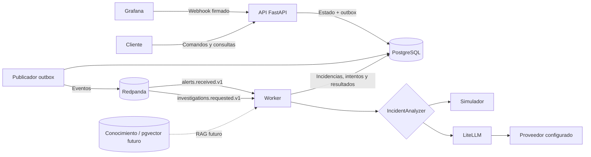
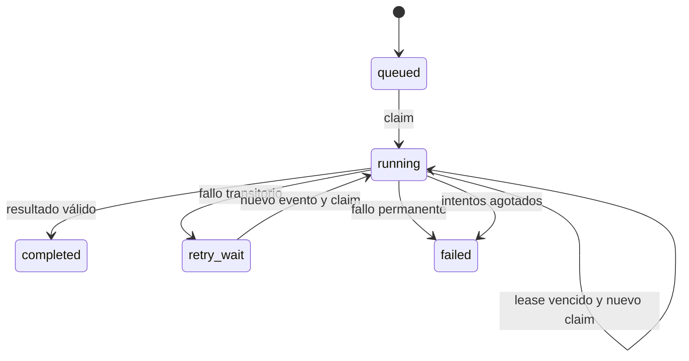
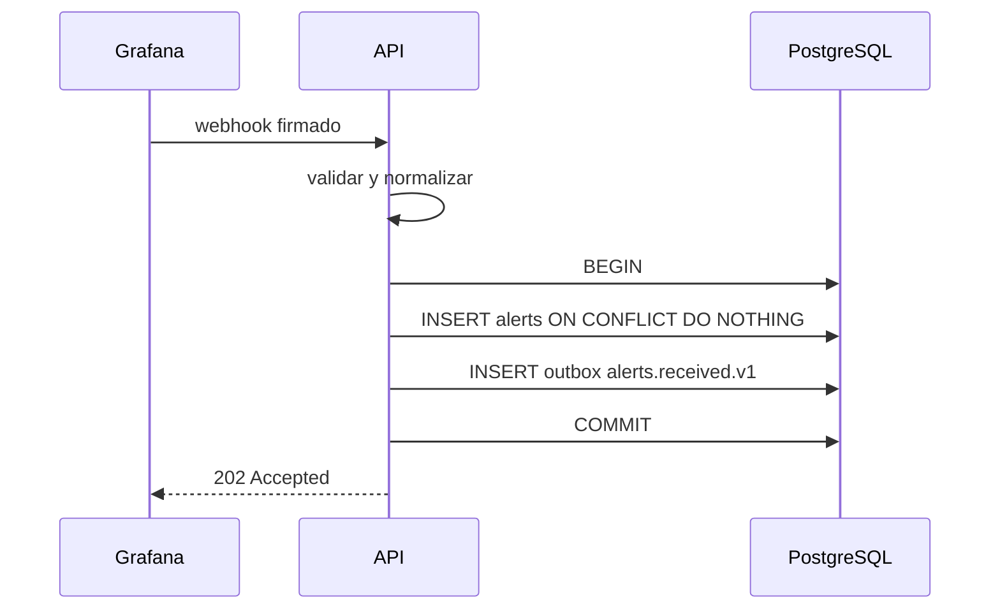
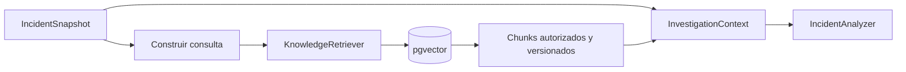

# Arquitectura de Vigilia

## 1. Propósito y alcance

Vigilia es un backend de investigación de incidentes operacionales. Recibe alertas
de sistemas externos, las normaliza, las correlaciona mediante reglas deterministas
y permite solicitar investigaciones durables. Una investigación puede ejecutarse
con un simulador sin coste o con un modelo configurado mediante LiteLLM.

El sistema está diseñado para poder responder con claridad:

- qué alerta originó o modificó una incidencia;
- qué transacción hizo durable cada cambio;
- qué evento provocó cada procesamiento posterior;
- qué revisión exacta de una incidencia analizó el modelo;
- qué evidencias utilizó para cada hipótesis;
- qué ocurre si fallan la API, el publicador, Kafka, el worker o el proveedor;
- qué modelo, consumo y coste estimado tuvo cada intento.

La correlación no usa IA. El modelo no decide qué alertas pertenecen a una
incidencia. Su responsabilidad empieza cuando ya existe una instantánea durable y
consistente que analizar.

RAG todavía no está implementado. La frontera ya acepta conocimiento operacional
para que la siguiente fase añada documentos y recuperación sin cambiar el worker ni
acoplar la aplicación a un proveedor de modelos.

## 2. Vista general



PostgreSQL es la fuente de verdad. Redpanda transporta notificaciones de trabajo,
pero no es la única copia del estado de negocio. Si se entrega un evento duplicado,
el consumidor puede reconocerlo; si se pierde temporalmente un worker, el trabajo
sigue representado en PostgreSQL.

## 3. Principios arquitectónicos

### 3.1 Dependencias hacia el dominio

La dirección de dependencias es:

```text
entrypoints ─┐
adapters ────┼──> application ──> domain
bootstrap ───┘
```

- `domain` no importa FastAPI, SQLAlchemy, Kafka ni LiteLLM.
- `application` coordina casos de uso y declara los puertos que necesita.
- `adapters` traduce HTTP, Grafana, PostgreSQL, Kafka y modelos externos.
- `bootstrap` elige implementaciones, crea recursos y define su ciclo de vida.
- Los entrypoints arrancan procesos; no contienen reglas de negocio.

Es una arquitectura de puertos y adaptadores aplicada de manera pragmática. No se
crean interfaces genéricas para todo: sólo se abstraen fronteras externas o
responsabilidades que realmente necesitan sustitución.

### 3.2 Estado durable antes que coordinación en memoria

No se usan conjuntos globales ni locks en memoria para decidir si una investigación
está activa. Las restricciones, estados, leases y tokens se almacenan en PostgreSQL.
El comportamiento sigue siendo correcto con varios procesos worker o después de un
reinicio.

### 3.3 Transacciones cortas alrededor de llamadas externas

Una llamada al broker o a un modelo puede tardar o fallar. Ninguna mantiene abierta
la transacción que reclama un trabajo. El patrón general es:

1. Leer y reclamar estado mediante una transacción corta.
2. Realizar I/O externo sin sesión ni bloqueo de base de datos.
3. Abrir otra transacción corta para confirmar el resultado.

## 4. Estructura del proyecto

```text
src/vigilia/
├── main.py                         # entrypoint de la API
├── worker.py                       # entrypoint de consumidores
├── publisher.py                    # entrypoint del publicador outbox
├── bootstrap/
│   ├── settings.py                 # configuración VIGILIA_ validada
│   ├── composition.py              # raíz de composición por proceso
│   └── resources.py                # apertura y cierre de recursos
├── domain/
│   ├── models.py                   # valores, snapshots y resultados
│   └── correlation.py              # reglas puras de correlación
├── application/
│   ├── contracts.py                # DTOs de lectura y sobre de eventos
│   ├── errors.py                   # errores estables de aplicación
│   ├── ports.py                    # UnitOfWork e IncidentAnalyzer
│   └── use_cases.py                # comandos, consultas y orquestación
├── adapters/
│   ├── grafana/                    # validación y normalización de webhooks
│   ├── http/                       # rutas, dependencias, seguridad y errores
│   ├── messaging/                  # Kafka/Redpanda y contratos entrantes
│   ├── postgres/                   # modelos, repositorios y Unit of Work
│   ├── simulation/                 # analizador determinista sin API
│   └── llm/                        # LiteLLM, prompt y salida estructurada
└── observability/
    └── logging.py                  # configuración común de logs

migrations/                         # evolución del esquema con Alembic
docs/decisions/                     # decisiones arquitectónicas breves
docker/                             # imágenes y composición local
```

### 4.1 Dominio

`domain/models.py` contiene los estados y datos que los casos de uso necesitan sin
exponer modelos ORM ni schemas de proveedor:

- `NormalizedAlert`: alerta ya traducida al lenguaje de Vigilia.
- `AlertEvidence`: proyección inmutable de una alerta usada como evidencia.
- `IncidentSnapshot`: revisión concreta de una incidencia y su línea temporal.
- `InvestigationContext`: snapshot más fragmentos de conocimiento recuperados.
- `AnalysisResult`: resultado de negocio persistible.
- `AnalysisUsage`: metadatos de ejecución del modelo.
- `AnalysisOutput`: resultado de negocio y uso técnico, mantenidos separados.

`domain/correlation.py` contiene reglas puras: ventana temporal, precedencia de
severidad y resolución según el último estado de cada fingerprint. Estas reglas no
abren conexiones ni publican mensajes.

### 4.2 Aplicación

Los casos de uso expresan lo que hace Vigilia:

- `IngestAlerts`: persiste alertas nuevas y crea sus eventos outbox.
- `CorrelateAlert`: agrupa una alerta en una incidencia de forma idempotente.
- `IncidentQueries`: sirve listados y detalles.
- `RequestInvestigation`: crea una solicitud durable y su evento.
- `ExecuteInvestigation`: reclama, analiza y finaliza o reprograma el trabajo.
- `InvestigationQueries`: devuelve estado, intentos, resultado y uso.

`UnitOfWork` es el puerto de persistencia transaccional. Expone las operaciones que
los casos de uso necesitan; no intenta ser un repositorio base universal.

`IncidentAnalyzer` es el puerto de análisis. Aplicación sólo conoce:

```python
class IncidentAnalyzer(Protocol):
    version: str
    provider: str
    model: str

    async def analyze(
        self, context: InvestigationContext
    ) -> AnalysisOutput: ...
```

No aparecen nombres de proveedores ni objetos de LiteLLM en el contrato.

### 4.3 Adaptadores

- HTTP convierte autenticación, parámetros y cuerpos en llamadas a casos de uso.
- Grafana convierte su payload en `NormalizedAlert`.
- PostgreSQL implementa consultas, escrituras y transacciones.
- Messaging convierte mensajes Kafka en `EventEnvelope` y controla offsets.
- Simulation implementa el puerto sin red ni consumo de tokens.
- LLM convierte `InvestigationContext` en mensajes, llama a LiteLLM, valida la
  respuesta y la traduce a objetos del dominio.

### 4.4 Bootstrap y procesos

`composition.py` es la raíz de composición. Es el lugar único donde una interfaz se
asocia a una implementación concreta. La API, el worker y el publicador no crean el
mismo conjunto de dependencias:

| Proceso | Recursos y casos de uso |
| --- | --- |
| API | Engine, ingesta, solicitud de investigación y consultas |
| Worker | Engine, correlación y analizador configurado |
| Publicador | Engine y productor Kafka creado por su entrypoint |

La API conoce la cadena `analyzer_version` para crear una solicitud reproducible,
pero no construye el analizador ni usa credenciales del modelo. Sólo el worker
construye el adaptador y realiza llamadas al proveedor.

## 5. Modelo de datos

| Tabla | Responsabilidad |
| --- | --- |
| `alerts` | Alertas normalizadas e idempotencia de ingesta |
| `incidents` | Estado agregado y número de revisión |
| `incident_alerts` | Relación durable entre incidencia y evidencia |
| `outbox_events` | Eventos pendientes, publicados y reprogramados |
| `processed_events` | Deduplicación por consumidor y evento |
| `investigations` | Solicitud, estado, lease, resultado y versión analizada |
| `investigation_attempts` | Intentos, errores, modelo, tokens, coste y latencia |
| `reports` | Informes históricos anteriores; lectura compatible |

La revisión de una incidencia aumenta únicamente cuando se adjunta una alerta nueva.
Una investigación guarda esa revisión al solicitarse. Aunque la incidencia cambie
después, el historial indica qué versión se pretendía analizar.

Los estados de una investigación son:



## 6. Flujo completo de una alerta

### 6.1 Recepción y normalización

1. Grafana envía `POST /webhooks/grafana`.
2. El adaptador HTTP verifica firma HMAC y antigüedad de la petición.
3. El normalizador convierte cada elemento al modelo `NormalizedAlert`.
4. `IngestAlerts` inserta sólo alertas que no violan la clave natural de
   idempotencia: origen, fingerprint, inicio y estado.
5. Por cada alerta insertada crea `alerts.received.v1` en `outbox_events` dentro de
   la misma transacción.
6. La API devuelve `202`; que el broker esté temporalmente caído no revierte la
   alerta ya aceptada.



### 6.2 Publicación outbox

1. El publicador reclama un lote con `FOR UPDATE SKIP LOCKED` y un `claim_token`.
2. Confirma rápidamente esa reclamación.
3. Publica fuera de la transacción con clave de partición estable.
4. En una transacción posterior marca éxitos como publicados.
5. Los fallos se reprograman con backoff y liberan su claim.

Puede ocurrir que Kafka acepte un evento y el proceso muera antes de marcarlo. Por
eso la garantía es al menos una vez y los consumidores deben aceptar duplicados.

### 6.3 Correlación en el worker

1. El worker recibe `alerts.received.v1`.
2. Comprueba `(consumer_name, event_id)` en `processed_events`.
3. Adquiere un advisory lock transaccional por servicio para serializar correlaciones
   que compiten por la misma incidencia.
4. Una alerta `firing` busca una incidencia abierta reciente del mismo servicio; si
   no existe, crea una.
5. Una alerta `resolved` busca la incidencia abierta asociada al fingerprint.
6. Adjunta la alerta con una relación idempotente.
7. Si la relación era nueva, actualiza revisión, severidad, tiempos y posible estado
   resuelto.
8. Marca el evento como procesado en la misma transacción.
9. Sólo entonces confirma el offset Kafka.

La correlación es determinista y se puede explicar sin consultar al modelo.

## 7. Flujo completo de una investigación

### 7.1 Solicitud HTTP

1. El cliente llama `POST /incidents/{id}/investigations`.
2. `RequestInvestigation` bloquea la incidencia durante la operación.
3. Si existe `Idempotency-Key`, reutiliza la solicitud previamente creada.
4. Una restricción parcial impide dos investigaciones activas para la misma
   incidencia, revisión y versión del analizador.
5. Crea `investigations` en estado `queued` y el evento
   `investigations.requested.v1` en la misma transacción.
6. Devuelve `202`, el ID y la cabecera `Location` sin esperar al modelo.

### 7.2 Claim e instantánea

Cuando el worker recibe el evento:

1. Deduplica el evento para su consumidor.
2. Bloquea la fila de investigación.
3. Ignora trabajos terminales o todavía no disponibles.
4. Si un lease anterior venció, cierra aquel intento como fallido.
5. Genera un `attempt_token`, incrementa el contador y establece un lease.
6. Crea una fila `investigation_attempts`.
7. Lee incidencia y alertas y construye un `IncidentSnapshot` inmutable.
8. Confirma la transacción.

La llamada al analizador se hace después, sin mantener conexión o bloqueo de base de
datos. El token de intento actúa como fencing token: un worker antiguo no puede
sobrescribir el resultado de otro intento que ya tomó posesión.

### 7.3 Análisis

El analizador configurado recibe `InvestigationContext`:

- El simulador produce una respuesta determinista y coste cero.
- LiteLLM permite elegir proveedor y modelo mediante configuración.

El adaptador LLM realiza estos pasos:

1. Selecciona como máximo las alertas recientes configuradas.
2. Asigna IDs explícitos `alert:<uuid>` a las evidencias.
3. Serializa el contexto como JSON, separado de las instrucciones.
4. Declara que alertas y futuros documentos son datos no confiables.
5. Solicita JSON Schema estricto con `outcome`, resumen, hipótesis, IDs citados,
   comprobaciones y datos ausentes.
6. Valida el JSON con Pydantic.
7. Verifica que cada referencia exista realmente en el contexto enviado.
8. Construye la evidencia final desde datos locales, no copiando descripciones
   inventadas por el modelo.
9. Extrae proveedor, modelo, tokens, coste estimado, ID de respuesta y latencia.

El resultado no contiene una confianza numérica presentada como probabilidad. Una
hipótesis es una explicación para comprobar, no una causa raíz confirmada.

### 7.4 Finalización y reintentos

Con un resultado válido, el worker abre otra transacción, comprueba el token, guarda
el informe y completa el intento. Con un fallo:

- Timeout, rate limit, conexión, indisponibilidad y errores 5xx son transitorios.
- Credenciales, permisos, modelo inexistente, parámetros incompatibles, ventana de
  contexto, política de contenido o salida inválida son permanentes.
- Los fallos transitorios crean un nuevo evento outbox con backoff exponencial hasta
  el máximo de intentos.
- Los permanentes terminan inmediatamente en `failed` para no gastar llamadas que no
  pueden recuperarse.
- Errores inesperados se registran internamente y se persiste un mensaje seguro, sin
  exponer detalles o secretos del SDK.

## 8. Integración LLM agnóstica

La selección se realiza con:

```env
VIGILIA_INVESTIGATION_ANALYZER=litellm
VIGILIA_LLM_MODEL=provider/model
VIGILIA_LLM_API_KEY=optional-generic-key
VIGILIA_LLM_API_BASE=optional-compatible-endpoint
```

También pueden usarse variables específicas reconocidas por LiteLLM. El código de
Vigilia no decide cómo se llama la variable de Anthropic, OpenAI, Vertex, Bedrock,
Ollama u otro proveedor.

La agnosticidad tiene límites explícitos:

- El modelo elegido debe aceptar salida estructurada JSON Schema a través de
  LiteLLM.
- La semántica mínima del resultado pertenece a Vigilia y no cambia por proveedor.
- `analyzer_version` incluye modelo y versión del contrato para distinguir resultados.
- No se activan fallbacks automáticos ni reintentos ocultos; cambiar de modelo en
  mitad de un trabajo dañaría la reproducibilidad.
- El coste informado por LiteLLM es una estimación; la factura del proveedor manda.

## 9. Patrones utilizados

### Puertos y adaptadores

Separa reglas y orquestación de FastAPI, PostgreSQL, Kafka y proveedores LLM.

### Unit of Work

Cada caso de uso abre una unidad de trabajo. Commit, rollback y cierre pertenecen al
gestor async; una sesión nunca se comparte entre trabajos concurrentes.

### Transactional Outbox

El cambio de negocio y la intención de publicar se confirman juntos. Se evita el
dual write de guardar en PostgreSQL y publicar sin coordinación durable.

### Consumidor idempotente

`processed_events` registra el efecto por nombre de consumidor. Dos consumidores
pueden procesar legítimamente el mismo `event_id` con propósitos distintos.

### Lease y fencing token

El lease permite recuperar trabajos abandonados. El token evita que un poseedor
antiguo escriba después de perder la propiedad.

### Strategy

`IncidentAnalyzer` permite escoger simulación o LiteLLM en composición sin
condicionar el caso de uso.

### DTO y snapshot

Los contratos HTTP, modelos ORM, respuestas del SDK y objetos del dominio son tipos
distintos. El snapshot fija la entrada analizada y evita entregar entidades ORM fuera
de su transacción.

## 10. Seguridad y privacidad

- El webhook usa HMAC y una ventana temporal para dificultar replay.
- La API de incidencias usa Bearer token.
- Sólo el worker entrega credenciales al adaptador y llama al modelo.
- No se registran secretos, prompts completos ni respuestas completas.
- El prompt trata campos externos como datos, mitigando inyección desde alertas.
- El modelo sólo puede citar IDs enviados y Vigilia reconstruye sus fuentes.
- No se ejecutan acciones correctivas ni herramientas propuestas por el modelo.

Estas medidas reducen riesgo, pero no convierten una hipótesis generada en verdad. La
salida debe leerse como ayuda a la investigación humana.

## 11. Observabilidad

Los identificadores relevantes atraviesan los eventos: `event_id`, `aggregate_id`,
`correlation_id` y `causation_id`. Las investigaciones añaden `investigation_id`,
número de intento y token.

Cada intento conserva el analizador y modelo configurados. Cuando el proveedor
responde correctamente, se actualizan con los valores efectivos y además se guarda:

- proveedor y modelo efectivos;
- ID de respuesta del proveedor;
- tokens de entrada, entrada cacheada, salida y total cuando están disponibles;
- coste estimado en USD cuando LiteLLM puede calcularlo;
- latencia total observada por el adaptador.

Los campos son anulables porque no todos los proveedores devuelven el mismo nivel de
telemetría. La ausencia de una estimación no impide guardar un análisis válido.

## 12. Consistencia y garantías

Vigilia garantiza:

- estado de negocio y outbox atómicos;
- entrega y procesamiento al menos una vez;
- deduplicación durable por consumidor;
- una sola investigación activa por revisión y versión de analizador;
- ninguna conexión PostgreSQL retenida durante una llamada LLM;
- protección contra escrituras de workers con leases obsoletos;
- historial de intentos y resultados terminales consultable.

Vigilia no garantiza:

- ejecución exactamente una vez en un proveedor externo;
- que una llamada fallida no haya sido facturada;
- exactitud factual de las hipótesis generadas;
- que el coste estimado coincida exactamente con facturación;
- orden global entre servicios o particiones Kafka.

## 13. Configuración y ciclo de vida

Toda configuración propia usa el prefijo `VIGILIA_`. `Settings` valida rangos y exige
un modelo cuando el analizador seleccionado es LiteLLM. El modo predeterminado es el
simulador, por lo que arrancar localmente no consume tokens.

Los engines se crean por proceso y se cierran al salir de su gestor de recursos. Las
sesiones se crean por operación. Los clientes Kafka pertenecen al entrypoint que los
usa y se cierran durante el apagado ordenado.

## 14. Frontera preparada para RAG

`InvestigationContext` ya contiene:

```text
incident: IncidentSnapshot
knowledge: tuple[KnowledgeEvidence, ...]
```

Actualmente `knowledge` está vacío. La siguiente fase añadirá un puerto de
recuperación antes de llamar al analizador:



El futuro recuperador pertenecerá a aplicación y adaptadores, no a LiteLLM. La
indexación será un pipeline separado de la investigación. Cada fragmento tendrá ID,
documento, versión y servicio; las citas usarán `knowledge:<uuid>` y se validarán con
la misma regla aplicada hoy a las alertas.

Quedan deliberadamente fuera de esta fase:

- tablas de documentos y chunks;
- extensión pgvector e índices vectoriales;
- estrategia de fragmentación;
- adaptador de embeddings;
- filtros por servicio y dependencias;
- presupuesto de contexto y ranking híbrido;
- evaluaciones de recuperación y fundamentación.

## 15. Decisiones relacionadas

- [ADR 0001: Async SQLAlchemy persistence](decisions/0001-async-sqlalchemy.md)
- [ADR 0002: Durable investigation jobs](decisions/0002-durable-investigations.md)
- [ADR 0003: Provider-agnostic model adapter through LiteLLM](decisions/0003-provider-agnostic-llm.md)
